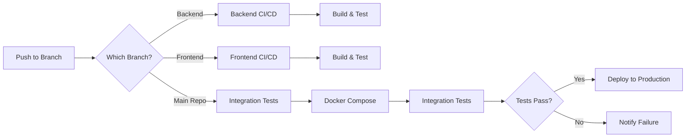

# 🎮 Broken.GG - League of Legends Match History Tracker

[](https://github.com/Broken-GG/BrokenGG/actions)
[](https://github.com/Broken-GG/Backend/actions)
[](https://github.com/Broken-GG/Frontend/actions)
[](https://opensource.org/licenses/MIT)

> A full-stack web application inspired by OP.GG for tracking League of Legends summoner statistics and match history.

**Live Demo:** Coming Soon | **Documentation:** [View Docs](#api-documentation)

## 📋 Table of Contents

- [Features](#-features)
- [Architecture](#-architecture)
- [Tech Stack](#-tech-stack)
- [Quick Start](#-quick-start)
- [Development](#-development)
- [Docker Deployment](#-docker-deployment)
- [API Documentation](#-api-documentation)
- [CI/CD Pipeline](#-cicd-pipeline)
- [Contributing](#-contributing)
- [License](#-license)

## ✨ Features

- 🔍 Search summoners by name and tag (e.g., Faker#T1)
- 📊 View detailed match history with statistics
- 🏆 Display ranked information and mastery data
- 👥 Show all players in each match with champion details
- 📈 KDA, CS, Vision Score, and item tracking
- 🎯 Champion icons, summoner spells, and items display

## 🏗 Architecture

This is a **monorepo** containing two separate services orchestrated via Docker Compose:

```
┌─────────────────────────────────────────────────────┐
│                   BrokenGG Monorepo                  │
├──────────────────────┬──────────────────────────────┤
│  Frontend (Submodule) │  Backend (Submodule)         │
│  ├─ TypeScript/JS     │  ├─ .NET 9 Web API          │
│  ├─ Vite Build        │  ├─ Riot API Integration    │
│  └─ Nginx Server      │  └─ RESTful Endpoints       │
└──────────────────────┴──────────────────────────────┘
                         │
              Docker Compose Orchestration
```

- **Frontend Repository:** [Broken-GG/Frontend](https://github.com/Broken-GG/Frontend)
- **Backend Repository:** [Broken-GG/Backend](https://github.com/Broken-GG/Backend)

## 🛠 Tech Stack

<table>
<tr>
<td width="50%">

### Backend


- **ASP.NET Core 9.0** - Web API framework
- **Swagger/OpenAPI** - API documentation
- **xUnit** - Unit & integration testing
- **Riot Games API** - Data source

</td>
<td width="50%">

### Frontend


- **TypeScript** - Type-safe JavaScript
- **Vite** - Modern build tool
- **Vanilla JS** - No framework overhead
- **Nginx** - Production web server

</td>
</tr>
</table>

### DevOps & CI/CD


- **Docker** - Container platform
- **Docker Compose** - Multi-service orchestration
- **GitHub Actions** - Automated testing & deployment
- **Branch Protection** - Main/develop protected branches 

## 📁 Project Structure

```
BrokenGG/
├── Backend/                    # .NET API Server
│   ├── src/
│   │   ├── api/
│   │   │   ├── controller/    # API Controllers
│   │   │   ├── models/        # Data models
│   │   │   ├── service/       # Business logic & external APIs
│   │   │   └── .env          # Environment variables (not in git)
│   │   └── test/             # Unit tests
│   ├── Program.cs            # Application entry point
│   ├── Backend.csproj        # Project configuration
│   ├── Dockerfile            # Backend container config
│   └── README.md
│
├── Frontend/                  # Static Web Application
│   ├── public/
│   │   ├── index.html        # Home page
│   │   ├── src/
│   │   │   ├── js/           # JavaScript modules
│   │   │   ├── styles/       # CSS stylesheets
│   │   │   └── pages/        # Additional HTML pages
│   ├── Dockerfile            # Frontend container config
│   ├── nginx.conf            # Nginx configuration
│   └── README.md
│
├── docker-compose.yml        # Multi-service orchestration
└── README.md                 # This file
```

## 🚀 Quick Start

### Prerequisites

| Requirement | Version | Purpose |
|------------|---------|---------|
| **Docker** & **Docker Compose** | Latest | 🐳 Recommended approach |
| **Git** | 2.0+ | Clone with submodules |
| **Riot API Key** | - | [Get one here](https://developer.riotgames.com/) |

**OR** for local development:
- .NET 9 SDK
- Node.js 18+

### Installation

1. **Clone with submodules**
   ```bash
   git clone --recursive https://github.com/Broken-GG/BrokenGG.git
   cd BrokenGG
   ```

   If you already cloned without `--recursive`:
   ```bash
   git submodule update --init --recursive
   ```

2. **Configure environment**
   ```bash
   # Create Backend .env file
   cd Backend
   cp .env.example .env
   # Edit .env and add your RIOT_API_KEY
   ```

3. **Start with Docker Compose** 🐳
   ```bash
   docker compose up --build
   ```

4. **Access the application**
   - 🌐 **Frontend:** http://localhost
   - 🔌 **Backend API:** http://localhost:5000
   - 📚 **API Docs:** http://localhost:5000/swagger

### Health Check
```bash
curl http://localhost:5000/api/health
# Should return: {"status":"Healthy"}
```

## 💻 Development

### Local Development (Without Docker)

<details>
<summary><b>Backend Development</b></summary>

```bash
cd Backend

# Install dependencies
dotnet restore

# Run in watch mode (auto-reload)
dotnet watch run

# Run tests
dotnet test

# Access API at http://localhost:5000
```

See [Backend README](https://github.com/Broken-GG/Backend#readme) for details.

</details>

<details>
<summary><b>Frontend Development</b></summary>

```bash
cd Frontend

# Install dependencies
npm install

# Start dev server with hot reload
npm run dev

# Build for production
npm run build

# Preview production build
npm run preview

# Access app at http://localhost:3000
```

See [Frontend README](https://github.com/Broken-GG/Frontend#readme) for details.

</details>

### Running Tests

```bash
# Backend tests
cd Backend
dotnet test --logger "console;verbosity=detailed"

# Frontend tests (if applicable)
cd Frontend
npm test
```

# OR use any static server
# Python 3
python -m http.server 8000 --directory public

# Node.js (npx)
npx serve public

# PHP
php -S localhost:8000 -t public
```

The frontend will be available at `http://localhost:8000`

## 🐳 Docker Deployment

### Docker Compose Commands

```bash
# Start services (detached mode)
docker compose up -d

# View logs
docker compose logs -f

# View specific service logs
docker compose logs -f backend
docker compose logs -f frontend

# Restart services
docker compose restart

# Stop services
docker compose down

# Stop and remove volumes
docker compose down -v

# Rebuild after code changes
docker compose up --build
```

### Production Deployment

```bash
# Build for production
docker compose -f docker-compose.yml build

# Deploy to server
# 1. Push images to registry (Docker Hub, ACR, ECR)
# 2. Pull on production server
# 3. Run with environment variables

# Example with Docker Hub
docker tag brokengg-backend:latest username/brokengg-backend:latest
docker push username/brokengg-backend:latest
```

### Container Health

```bash
# Check container status
docker compose ps

# Inspect container health
docker inspect brokengg-backend | grep -A 10 Health

# View resource usage
docker stats
```

## 📚 API Documentation

### Base URL
- **Development:** `http://localhost:5000/api`
- **Production:** Configure in deployment

### Interactive Documentation
Visit **Swagger UI** at: `http://localhost:5000/swagger`

### Key Endpoints

<details>
<summary><b>GET</b> /api/summoner/{name}/{tag} - Get Summoner Info</summary>

```bash
curl http://localhost:5000/api/summoner/Faker/T1
```

**Response:**
```json
{
  "summonerName": "Faker",
  "tagline": "T1",
  "puuid": "abc123...",
  "level": 623,
  "profileIconUrl": "https://..."
}
```
</details>

<details>
<summary><b>GET</b> /api/match/{puuid} - Get Match History</summary>

```bash
curl "http://localhost:5000/api/match/abc123?start=0&count=10"
```

**Query Parameters:**
- `start` - Offset (default: 0)
- `count` - Number of matches (default: 10, max: 20)

</details>

<details>
<summary><b>GET</b> /api/ranked/{puuid} - Get Ranked Info</summary>

Returns ranked stats for Solo/Duo, Flex, and other queues.

</details>

<details>
<summary><b>GET</b> /api/mastery/{puuid} - Get Champion Mastery</summary>

Returns top champion masteries for a summoner.

</details>

For complete API reference, see [Backend API Documentation](https://github.com/Broken-GG/Backend#api-endpoints).

## 🔄 CI/CD Pipeline

This project uses **GitHub Actions** for automated testing and deployment.

### Pipeline Workflow



### Pipeline Jobs

| Pipeline | Triggers | Jobs |
|----------|----------|------|
| **Backend CI/CD** | Push to Backend repo | Code quality, Unit tests, Integration tests, Docker build |
| **Frontend CI/CD** | Push to Frontend repo | Validation, Linting, Docker build |
| **Integration** | Push to main repo | Build both services, Integration tests, Security scan, Deploy |

### Branch Protection

- ✅ Main branch requires CI/CD to pass
- ✅ Develop branch protected
- ✅ Pull request reviews required
- ✅ Status checks must pass before merge

## 🔐 Environment Variables

| Variable | Description | Required | Default |
|----------|-------------|----------|---------|
| `RIOT_API_KEY` | Your Riot Games API key | ✅ Yes | - |
| `RIOT_API_URL` | Riot Account API endpoint | ❌ No | `https://europe.api.riotgames.com/...` |
| `RIOT_SUMMONER_URL` | Riot Summoner API endpoint | ❌ No | `https://euw1.api.riotgames.com/...` |
| `ASPNETCORE_ENVIRONMENT` | Runtime environment | ❌ No | `Development` |
| `ASPNETCORE_URLS` | Backend listen URLs | ❌ No | `http://+:8080` |

Get your API key at [developer.riotgames.com](https://developer.riotgames.com/)

## 🤝 Contributing

We welcome contributions! Please follow these steps:

1. **Fork** the repository
2. **Clone** your fork with submodules:
   ```bash
   git clone --recursive https://github.com/YOUR_USERNAME/BrokenGG.git
   ```
3. **Create** a feature branch:
   ```bash
   git checkout -b feature/amazing-feature
   ```
4. **Make** your changes and commit:
   ```bash
   git commit -m 'feat: add amazing feature'
   ```
   Follow [Conventional Commits](https://www.conventionalcommits.org/)
5. **Push** to your fork:
   ```bash
   git push origin feature/amazing-feature
   ```
6. **Open** a Pull Request

### Commit Message Format
```
type(scope): subject

Examples:
feat(backend): add match caching
fix(frontend): resolve search bug
docs(readme): update installation steps
```

## 🐛 Troubleshooting

<details>
<summary><b>Submodules not loading</b></summary>

```bash
git submodule update --init --recursive
```
</details>

<details>
<summary><b>Docker containers not starting</b></summary>

```bash
# Check logs
docker compose logs

# Rebuild from scratch
docker compose down -v
docker compose build --no-cache
docker compose up
```
</details>

<details>
<summary><b>API returns 401 Unauthorized</b></summary>

- Check your `RIOT_API_KEY` in `.env`
- Development keys expire every 24 hours
- Regenerate at [developer.riotgames.com](https://developer.riotgames.com/)
</details>

<details>
<summary><b>Port already in use</b></summary>

```bash
# Change ports in docker-compose.yml
# Or stop conflicting services
docker ps
docker stop <container_id>
```
</details>

## 📝 License

MIT License - see [LICENSE](LICENSE) file for details

**Note:** League of Legends and all related properties are trademarks of Riot Games, Inc.

## 🙏 Acknowledgments

- [Riot Games API](https://developer.riotgames.com/) - Data source
- [Data Dragon](https://developer.riotgames.com/docs/lol#data-dragon) - Game assets
- [OP.GG](https://op.gg) - Design inspiration

## 📊 Project Stats


## 🎯 Roadmap

- [x] Basic summoner search
- [x] Match history display
- [x] Ranked information
- [x] Champion mastery
- [x] Docker deployment
- [x] CI/CD pipeline
- [ ] Redis caching layer
- [ ] User authentication
- [ ] Historical data storage
- [ ] Advanced statistics & graphs
- [ ] Mobile responsive design
- [ ] Live game tracking
- [ ] Multi-region support

---

<p align="center">Made with ❤️ by the Broken.GG Team</p>
<p align="center">
  <a href="https://github.com/Broken-GG/BrokenGG/issues">Report Bug</a> •
  <a href="https://github.com/Broken-GG/BrokenGG/issues">Request Feature</a>
</p>

---

Made with ❤️ for the League of Legends community
